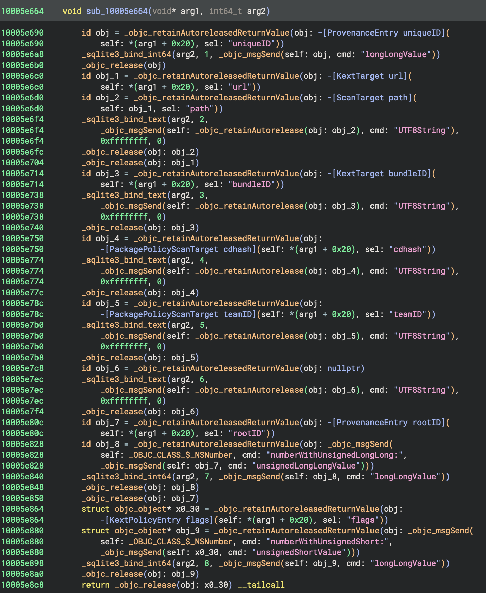
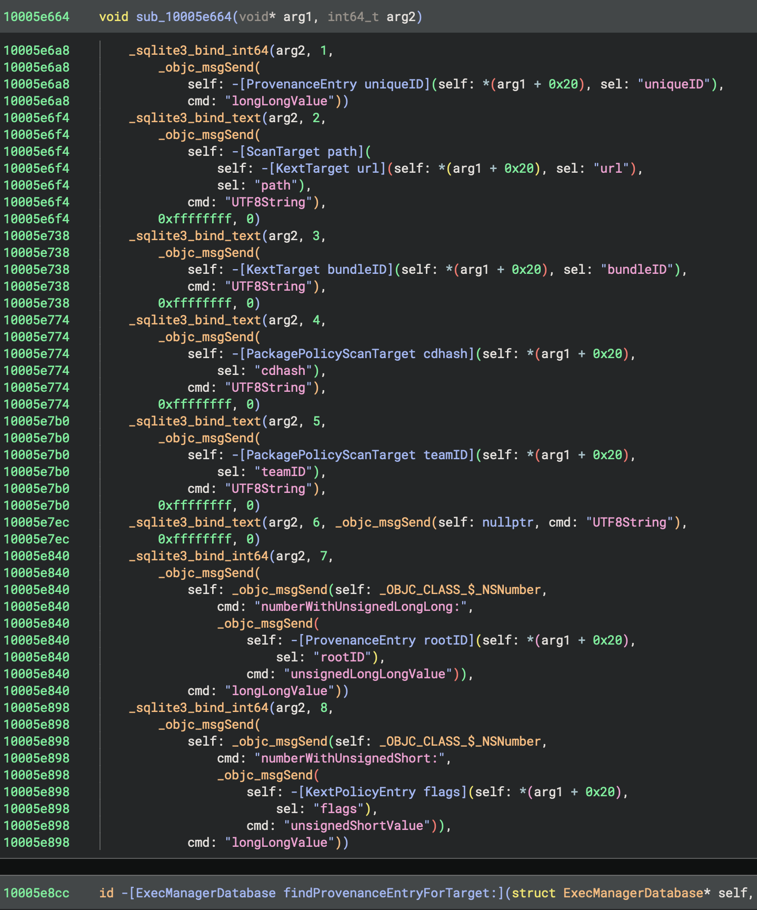
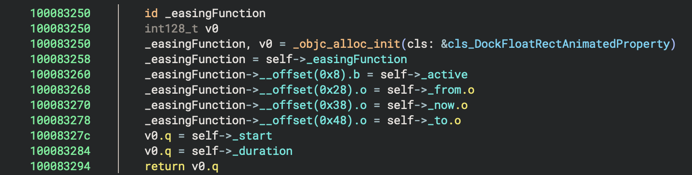
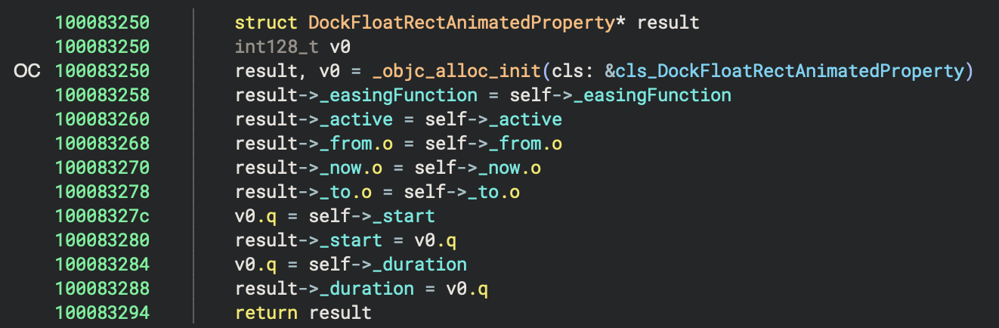

# Experimental improvements to Objective-C analysis for Binary Ninja

This Binary Ninja plug-in adds several additional types of analysis related to Objective-C runtime functions.
They are experimental and have some rough edges. The goal is to move each of the analysis types upstream
into Binary Ninja once they mature.

The additional analysis that is currently available is:
1. Removal of Objective-C runtime calls that deal purely with reference counting.
2. Propagation of type information for the return values of Objective-C runtime functions where it can be
   inferred based on function arguments.

More will be added as time permits.

## Supported Binary Ninja versions

Only recent versions of Binary Ninja 5.1-dev are supported.

## Installation

```
git clone https://github.com/bdash/bn-objc-extras.git
cd bn-objc-extras
cargo build --release
ln -sf $PWD/target/release/libbn_objc_extras.dylib ~/Library/Application\ Support/Binary\ Ninja/plugins/
```

## Configuration

As these analysis passes have rough edges they do not run by default. They can be applied on a per-function
basis via the `Function Analysis` context menu. If you're brave, you can enable them by default via the relevant
`bdash.objc` setting in Binary Ninja's settings.

## Details

### Remove Objective-C Memory Management Calls

This pass detects and removes calls to Objective-C runtime functions that deal purely with the reference count
of an object. Detected calls include:
   * `objc_autorelease`
   * `objc_autoreleaseReturnValue`
   * `objc_release`
   * `objc_retain`
   * `objc_retainAutorelease`
   * `objc_retainAutoreleasedReturnValue`

Removing these calls can make it much easier to follow the logic of a function.

| Before | After |
|--------|-------|
|  |  |

#### Limitations

In some cases eliminating memory management calls can lead to Binary Ninja's High Level IL view showing apparently dead code.
Temporarily disabling the analysis pass via the `Function Analysis` context menu is a quick way to understand what is going
on in these cases.

One common case of this is when an instance variable is loaded from an object and them immediately passed to `objc_release`
without otherwise being used. The only use of the variable is removed, but Binary Ninja preserves and displays the load
of the instance variable.

### Propagate Types from Objective-C Runtime Calls

This analysis pass detects calls to Objective-C runtime functions such as `objc_alloc` / `objc_alloc_init`
and overrides the return type of each call to the type corresponding to the class object passed to the
function[^1]. This can help with resolving accesses to instance variables and propagating object types
further on in the function.

| Before | After |
|--------|-------|
|  |  |

Note: due to [limitations in Binary Ninja's handling of call type adjustments](https://github.com/Vector35/binaryninja-api/issues/6737),
this pass is not available in images loaded from the dyld shared cache.

[^1]: It is not guaranteed that `-[Foo init]` will return an instance of `Foo`, but it does in the
overwhelmingly majority of cases. If you're analyzing some code that violates this assumption you
can either disable this analysis pass for the function in question, or manually override the type
at the callsite in question.
